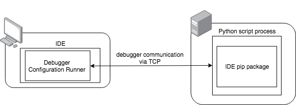

===============
Debugger Helper
===============

This package simplifies remote debugging for both PyCharm and Visual Studio Code. You could focus on actually solving
the root cause of a tough bug instead of using logging and dividing and conquering randomly to find where the problem
is.

Requirements
------------
- Visual Studio Code or Pycharm Professional
- Either ptvsd or pydevd_pycharm dependency installed

Installing
----------

``pip install git+ssh://git@github.com/2upmedia/debugger_helper``

How it works
------------

There's four parts to remote debugging with Python:

1. the server can communicate with your workstation
2. you have the corresponding IDE package installed on the server
3. your IDE is configured for remote debugging correctly
4. you run the remote debugging configuration in your IDE at the right time

There's a debug package for each IDE that serves as the debugger on the server. It communicates back and forth between
the server and the IDE.

You need to make sure that the server can communicate with your workstation. This is an *essential* part of remote
debugging because there are TCP packets sent back and forth between the server and the IDE. Those packets communicate
things like where the breakpoints are set and information about the current stack and variables. This is essentially
how all remote debuggers work.

The easiest way to allow a TCP line-of-communication that bypasses any firewall issues is by port forwarding. This is
possible with ssh or putty.

With ssh just issue ``ssh -R LOCAL_PORT:IP:REMOTE_PORT user@host`` for a reverse port forward and
``ssh -L LOCAL_PORT:IP:REMOTE_PORT user@host`` for a local port forward. Typically you'd use ``127.0.0.1`` for the IP and
the same port numbers, for example, ``ssh -L 9000:127.0.0.1:9000 user@host``. A local port forward means that a socket
is allocated and listening on your local machine and forwards the TCP connection to the specified remote port on the
server. A reverse port forward means that a socket is allocated and listening on your remote machine and forwards the
TCP connection to the specified local port on your machine. Visual Studio Code uses local port forwarding while
PyCharm needs reverse port forwarding.

To ensure that the server can communicate with your computer you could run the following commands on the server:

.. code:: bash

    $ openssl s_client -connect 127.0.0.1:9000
    connect_to 127.0.0.1 port 9000: failed.
    CONNECTED(00000004)

If you have telnet installed you could also try...

.. code:: bash

    $ telnet 127.0.0.1 9000
    Trying 127.0.0.1...
    Connected to localhost.

What you're looking for is ``CONNECTED`` for openssl. For telnet, if it doesn't exit telnet and doesn't get an error
after some time, then that means it's connected.

In terms of the setup, that means that for PyCharm you need to run the remote IDE configuration first *before* running
your python script while for Visual Studio Code you run it *after* your python script.

The remote debugger IDE settings define the host, port, and path mappings. The path mapping maps the folder path from
the server to the folder path on your local machine so that the debugger can pick up the correct file.

There are three environment variables that the debugger_helper module uses:

- ``START_DEBUGGER``
- ``DEBUGGER_HOST`` (default ``127.0.0.1``)
- ``DEBUGGER_PORT`` (default ``9000``)

The ``START_DEBUGGER`` environment variable should be set to any non-empty value such as ``1`` right before starting
the python script you'd like to debug.

If everything is set up correctly the debugger should immediately stop at your breakpoint. If this is not the case,
double check every step.

Setting up Visual Studio Code
-----------------------------
- install ``ptvsd`` on the *server*
- make sure ``pydevd-pycharm`` isn't installed as it conflicts with ``ptvsd``
- add a local port forward from your machine to the server via ssh (or putty)
- add the following to somewhere in the top-most part of your python project. For instance, if it's a Flask app with an app.py file you might place it right at the top after your imports.

.. code:: python

    import ptvsd
    debugger_helper.attach_vscode(lambda host, port: ptvsd.enable_attach(address=(host, port), redirect_output=True))

- go to the debug panel, add configuration, click on Python, then Remote Attach, set the host to ``127.0.0.1``, port to ``9000`` (or the port to match the port forwarding and the ``DEBUGGER_PORT`` environment variable)
- for ``remoteRoot``, set it to the absolute path of the folder containing your python script on the server. For instance, maybe it's residing in ``/www/pythonapp/``. You'd use that for ``remoteRoot``.
- set a breakpoint where you'd like the debugger to stop
- Run the python script ``$ START_DEBUGGER=1 python app.py`` and waiting until it says it's ready to connect to the debugger
- Run the Remote Attach configuration in Visual Studio Code.

Setting up Pycharm
------------------
- install ``pydevd_pycharm`` on the *server*
- add a reverse port forward from the server to your machine via ssh (or putty)
- add a Run Configuration for Python Remote Debug. Set the host to ``127.0.0.1`` and port ``9000``.
- in the configuration and path mapping field add a mapping for the absolute path of the project root to the absolute path of the same project root, but on the server
- add the following to somewhere in the top-most part of your python project. For instance, if it's a Flask app with an app.py file you might place it right at the top after your imports.

.. code:: python

    import pydevd_pycharm
    debugger_helper.attach_pycharm(lambda host, port: pydevd_pycharm.settrace(host, port=port, stdoutToServer=True, stderrToServer=True))

- set a breakpoint where you'd like the debugger to stop. You may set ``pydevd_pycharm.settrace(..., suspend=False)`` if you'd like to avoid the debugger from stopping on the line that ``settrace`` is on.
- Run the Remote Debug configuration in PyCharm.
- Run the python script ``$ START_DEBUGGER=1 python app.py``

Restart server on file changes with watchgod
--------------------------------------------

- install ``watchgod``
- create a second script that will call your main python script that turns on the debugger. It should look something like this:

.. code:: python

    # debug.py
    import subprocess

    def main():
        subprocess.call(['python', 'app.py']) # that's the same as the shell command ``$ python app.py``

- Run the python script with watchgod ``$ START_DEBUGGER=1 watchgod debug.main``

Only turn on the debugger for certain routes in Flask (only supported with PyCharm)
-----------------------------------------------------------------------------------

- create a function that'll check a query parameter and then trigger the debugger to start
- notice the ``call_immediately=True`` argument in ``attach_pycharm``. That allows you to trigger the debugger based on your set of rules.
- call this function in the body of the route

.. code:: python

    from flask import Flask, request

    is_debugger_enabled = False

    def attach_debugger():
        global is_debugger_enabled
        if request.args.get('START_DEBUGGER', ''):
            debugger_helper.attach_pycharm(lambda host, port: pydevd_pycharm.settrace(host, port=port, stdoutToServer=True, stderrToServer=True, suspend=False), call_immediately=True)
            is_debugger_enabled = True
        elif is_debugger_enabled:
            print('Trying to disable debugger that was enabled. Killing process to start a fresh one.')
            sys.exit(1)

    @app.route("/")
    def hello():
        attach_debugger()
        message = "Hello Worlddd!"
        return message

- follow the instructions for `Setting up Pycharm`_ above
- call the URL in the browser with the query parameter ``START_DEBUGGER`` appended to it. http://IP:5000/?START_DEBUGGER=1
